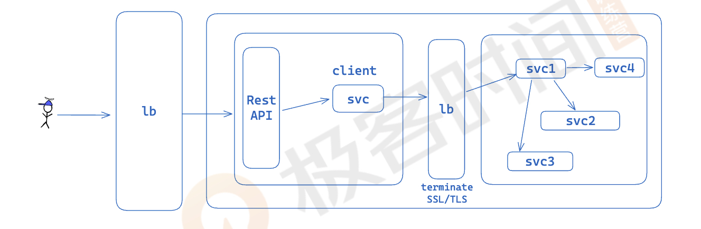
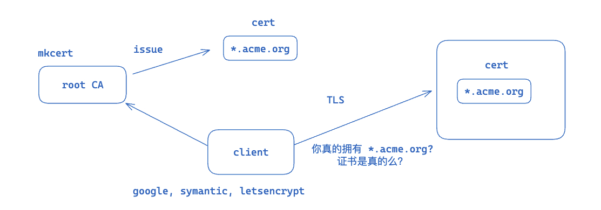

# CRM

## Generate test data

### Run migration to create `user_stats` table

```bash
sqlx migrate run --target-version 20240706163534
```

### Run script to generate test data

```bash
cd user-stat
cargo run --example gen --release
```

### Run migration to create indexes for `user_stats` table

```bash
sqlx migrate run
```

### Run generate script

```bash
cd user-stat
cargo run --example gen --release
```

## Some useful commands

### Get indexes size

```bash
select pg_size_pretty (pg_indexes_size('user_stats')) size;
```

### Get data size

```bash
select pg_size_pretty (pg_relation_size('user_stats')) size;
```

### Create export table

```sql
create table export_user_stats as select * from user_stats limit 100;
```

## Use Nginx to proxy gRPC

> https://nginx.org/en/docs/http/ngx_http_grpc_module.html



### Install Nginx in MacOS

```bash
brew install nginx
```

### Configuration Nginx

```bash
code /opt/homebrew/etc/nginx/nginx.conf
```

```conf
server {
    listen 8080;
    http2 on;
    server_name localhost;

    location / {
      # The 'grpc://' prefix is optional; unencrypted gRPC is the default
      grpc_pass grpc://[::1]:50000;  # grpcs for grpc with tls/ssl
    }
}
```

### Start Nginx

```bash
brew services start nginx
```

## Generate root CA by mkcert

> https://github.com/FiloSottile/mkcert



### Install mkcert

```bash
brew install mkcert
```

### Generate root CA

```bash
mkcert -install
```

### Generate certificate for local development

```bash
mkcert "*.acme.org" localhost 127.0.0.1 ::1
```

### Look for root CA pem

```bash
mkcert -CAROOT
```

### Copy rootCA.pem into fixtures directory

```bash
cp /Users/${user}/Library/Application\ Support/mkcert/rootCA.pem ./fixtures/rootCA.pem
```
